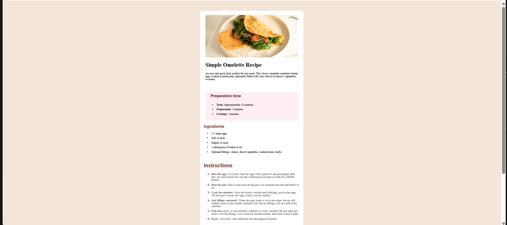

# Frontend Mentor - Recipe Page Solution

This is my solution to the **Recipe Page** challenge on Frontend Mentor. The goal of this project was to recreate a responsive recipe page using semantic HTML and CSS while following the provided design as closely as possible.

## Overview

### The Challenge

Users should be able to:

- View the recipe page on different screen sizes.
- Read the recipe content with a clean and responsive layout.
- Experience proper spacing, typography, lists, and table styling.

### Screenshot

### Links

- **Solution URL:** https://www.frontendmentor.io/solutions/your-solution-link
- **Live Site:** https://your-live-site-url.com

---

## My Process

### Built With

- Semantic HTML5
- CSS3
- Flexbox
- Responsive Design
- Custom Fonts using `@font-face`
- CSS Tables
- Ordered and Unordered Lists

### What I Learned

While building this project, I practiced and improved my understanding of:

- Creating semantic page layouts using HTML5.
- Styling lists and customizing list markers.
- Working with images and responsive containers.
- Using Flexbox for layout and alignment.
- Applying custom fonts with `@font-face`.
- Creating and styling HTML tables.
- Managing spacing with margin and padding.
- Using borders, border-radius, and background colors effectively.

### Continued Development

In future projects, I want to continue improving my skills in:

- CSS Grid
- Responsive layouts
- JavaScript
- React
- Accessibility and semantic HTML

---

## AI Collaboration

I used **ChatGPT** as a learning assistant during this project. It helped me understand CSS concepts such as Flexbox, spacing, image alignment, list styling, table formatting, custom fonts, and responsive design. Rather than generating the complete project, it guided me through solving problems and understanding how different CSS properties work.

---

## Author

- **GitHub:** https://github.com/Arhamali06
- **Frontend Mentor:** https://www.frontendmentor.io/profile/Arhamali06
- **LinkedIn:** https://www.linkedin.com/in/arhamali06

---

## Acknowledgments

Thanks to **Frontend Mentor** for providing practical frontend challenges that help developers improve their HTML and CSS skills through real-world projects.